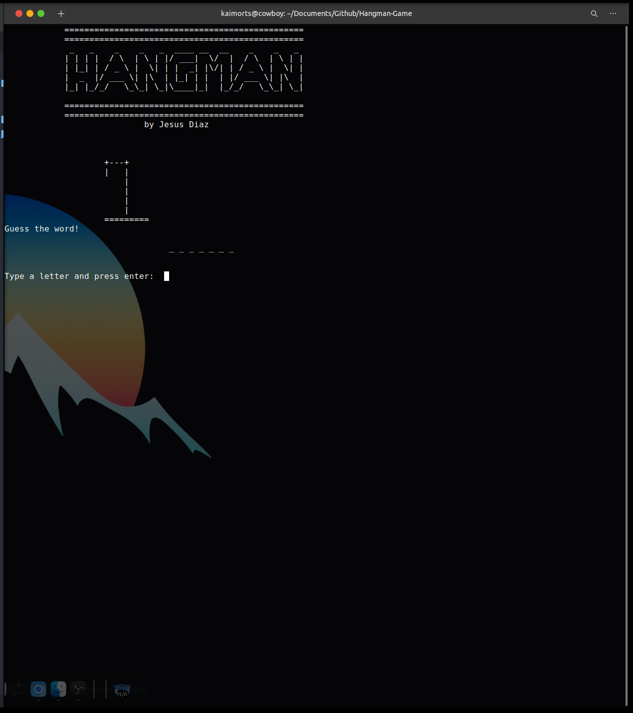
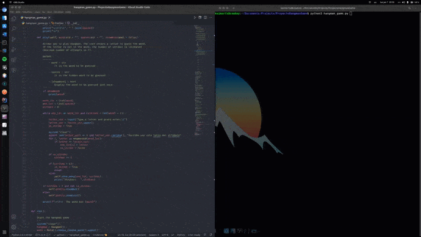

# HANGMAN GAME

* __Author__: Jesus Diaz [@dimekai](https://github.com/dimekai)
* Language: [Python](https://www.python.org/)
* Date: June 2021
* Version: 1.0



<p></p>




## Instructions to play
1. Download the repository, you just have to execute the next command in the command line:

```>  git clone https://github.com/dimekai/Hangman-Game```

2. Execute the script:

```> python3 hangman_game.py ```

